<h1 align="center">Hi, I'm Raúl 👋</h1>

  <em>Senior Data & Business Analyst · Supply Chain & Operations · FinOps</em> 
  10+ years turning complex data into decisions that move the business forward.

  🟢 <strong>Actively seeking full-time roles</strong> — Senior Data/Business Analyst, Operations/Supply Chain Analyst, or Inventory/Demand Manager

---

## 🙋 About me

- 📊 10+ years in **FinOps, supply chain, and operations analytics** at Texas Instruments
- 🎓 **MS in Business Analytics** candidate at Baruch College (Zicklin), graduating December 2026
- 🧰 I build end-to-end pipelines — from raw API data to production dashboards and statistical models
- 🤝 Always open to connecting, collaborating, or discussing analytics problems

---

## 🛠️ Tech stack

---

## 📈 GitHub stats

  
  

---

## 🗂️ Projects by Industry

### 🚚 Supply Chain & Logistics

#### 📌 [NYC Last-Mile Logistics Gap Analysis](https://raulsolanavarro.github.io/nyc-lastmile-logistics/)
**Business question:** Which NYC neighborhoods lack adequate warehouse coverage, and how many people live in those gaps?

Combines 2020 Census tract population data with NYC's PLUTO property database to map industrial facility coverage across all five boroughs. Applies a 1-mile service radius buffer, identifies underserved tracts, and quantifies the population exposure. Delivers borough-level breakdowns, three cartographic outputs (ggplot2 + QGIS), and actionable micro-fulfillment siting recommendations for logistics operators.

`R` · `sf` · `tidycensus` · `ggplot2` · `QGIS` · `Socrata API` · `Spatial Analysis` · `NYC Open Data`

#### 📌 [NYC Traffic & Road Infrastructure Analysis](https://raulsolanavarro.github.io/nyc-analytics-project-rjsn/)
**Business question:** Does traffic volume drive infrastructure degradation, and does city response time vary by borough?

Integrates NYC 311 Service Requests and DOT Automated Traffic Volume Counts (2020–2025) into a Kimball star-schema data warehouse. Implements a full ELT pipeline using the Socrata API, Google Cloud Functions, BigQuery, and dbt, then surfaces findings through a Looker Studio dashboard.

`SQL` · `BigQuery` · `dbt` · `Looker Studio` · `Python` · `Data Warehousing` · `Kimball` · `NYC Open Data`

*CIS 9440 · Data Warehousing and Analytics · Spring 2026*

---

### 📡 Media & Audience Measurement

#### 📌 [Do Netflix's Rankings and Wikipedia Attention Agree?](https://raulsolanavarro.github.io/intl-streaming-measurement-check/)
**Business question:** How well does a third-party signal (Wikipedia pageviews) agree with Netflix's own weekly Top 10 rankings across international markets?

Reconciles first-party (Netflix Top 10) and third-party (Wikipedia pageviews) viewership signals across six international markets over 12 weeks, covering 378 titles and 641 title-market pairs. Maps titles through Wikidata, loads into BigQuery, and measures market-level agreement with week-level bootstrap confidence intervals. Closes with six measurement recommendations for a media analytics team. ([Code](https://github.com/RaulSolaNavarro/intl-streaming-measurement-check))

`Python` · `BigQuery` · `SQL` · `Tableau` · `Quarto` · `Wikidata API` · `Bootstrap Inference` · `Data Reconciliation`

---

### 🏙️ Urban Analytics & Public Policy

#### 📌 [Does Neighborhood Income Affect NYC 311 Resolution Times?](https://raulsolanavarro.github.io/STA9750-2026-SPRING/individual_report_raul.html)
**Business question:** Do lower-income neighborhoods wait longer for city services, and if so, is that driven by differential treatment or by what they report?

Analyzes 12.6 million closed NYC 311 service requests (2022–2025) spatially joined to census-tract income data. The raw gap is real (43% longer for the lowest-income quintile), but OLS, bootstrap confidence intervals, and quantile regression show the disparity is driven by complaint type composition, not differential treatment. Part of a four-person capstone ([joint summary report](https://raulsolanavarro.github.io/STA9750-2026-SPRING/summary_report.html)).

`R` · `sf` · `tidycensus` · `leaflet` · `quantreg` · `Spatial Analysis` · `Regression` · `NYC Open Data`

*STA 9750 · Software Tools for Data Analysis · Spring 2026*

#### 📌 [NYC Restaurant Inspection Analysis](https://raulsolanavarro.github.io/reptalytics/reptalytics_report.html)
**Business question:** What patterns in health code violations and closure rates should restaurant operators and regulators prioritize?

Analyzes over 160,000 NYC Department of Health restaurant inspections (2021–2024), uncovering borough-level grade differences validated with ANOVA, closure rate trends, and the most common violations by cuisine category.

`Python` · `Quarto` · `Data Analysis` · `NYC Open Data` · `Public Health`

*CIS 9650 · Programming Tools for Analytics · Fall 2025*

#### 📌 [Assessing the Impact of SFFA on Campus Diversity](https://raulsolanavarro.github.io/STA9750-2026-SPRING/mp01.html)
**Business question:** How have demographic trends at U.S. colleges shifted following the Supreme Court's affirmative action ruling?

Data-driven analysis of enrollment trends across U.S. institutions following the *Students for Fair Admissions* decision, identifying which institution types and demographics show the strongest signal.

`R` · `Data Analysis` · `Higher Ed Policy`

*STA 9750 · Software Tools for Data Analysis · Spring 2026*

---

### 📊 Marketing & Customer Analytics

#### 📌 [Customer Churn Prediction Analysis](https://raulsolanavarro.github.io/CIS9660-2026-SPRING/churn-report.html)
**Business question:** Which customers are most likely to churn, and what actions should the retention team prioritize?

Binary classification study on telecom customer churn using the Kaggle Telco dataset. Builds and evaluates a logistic regression model with interaction terms, tunes the classification threshold to maximize recall, and translates model coefficients into actionable retention strategies.

`Python` · `Logistic Regression` · `Classification` · `Customer Analytics` · `Telecom`

*CIS 9660 · Machine Learning for Business Analytics · Spring 2026*

---

### 🏅 Sports Analytics

#### 📌 [Going for the Gold: Forecasting Team USA at LA 2028](https://raulsolanavarro.github.io/STA9750-2026-SPRING/mp04.html)
**Business question:** How many gold medals should sponsors expect Team USA to win at the 2028 Los Angeles Olympics?

Builds a four-factor model (US baseline, host nation effect, new sport bonus, GDP per capita) using historical Olympic data scraped from Olympedia across all modern Summer and Winter Games. Estimates effects with bootstrap confidence intervals via the infer package, then runs a 1,000,000-draw Monte Carlo simulation. Model reliability validated against 13 past host nations. Delivered as a fundraising brief for the LA 2028 Organizing Committee.

`R` · `rvest` · `tidyverse` · `infer` · `ggplot2` · `gt` · `Monte Carlo Simulation` · `Web Scraping` · `Bootstrap Inference` · `World Bank API` · `Olympedia` · `Quarto`

*STA 9750 · Software Tools for Data Analysis · Spring 2026*

---

### 👥 Demographics & Social Research

#### 📌 [Who Goes There? US Internal Migration and Congressional Reapportionment](https://raulsolanavarro.github.io/STA9750-2026-SPRING/mp03.html)
**Business question:** Where are Americans moving, what does it mean for congressional representation after 2030, and how should Texas protect its political footprint?

Analyzes American Community Survey migration flow data to identify dominant corridors, quantify Texas's inbound growth, and close with a data-driven advertising strategy for preserving congressional seats.

`R` · `Data Analysis` · `Demographics` · `Migration` · `Political Geography`

*STA 9750 · Software Tools for Data Analysis · Spring 2026*

#### 📌 [Know Your Time: Data-Driven Profiles for a Time-Tracking App](https://raulsolanavarro.github.io/STA9750-2026-SPRING/mp02.html)
**Business question:** How do different demographic groups actually spend their time, and what user profiles should a time-tracking app be built around?

Explores two decades of American Time Use Survey data to identify behavioral patterns by demographic segment and translate them into actionable product personas for a gamified app.

`R` · `Data Analysis` · `Time Use` · `Survey Data`

*STA 9750 · Software Tools for Data Analysis · Spring 2026*

---

## 🔍 Find projects by technology

**Languages**
- Python — Netflix/Wikipedia, NYC Restaurants, Customer Churn, NYC Traffic
- R — Last-Mile Logistics, NYC 311, SFFA, Customer Time Use, Migration, Olympics, NYC Traffic (ELT)
- SQL — Netflix/Wikipedia, NYC Traffic

**BI & Visualization**
- Tableau — Netflix/Wikipedia
- Looker Studio — NYC Traffic
- ggplot2 / Quarto — Last-Mile Logistics, NYC Restaurants, Olympics, NYC 311

**Cloud & Data Platforms**
- BigQuery — Netflix/Wikipedia, NYC Traffic
- dbt — NYC Traffic
- Google Cloud Functions — NYC Traffic

**Statistical & ML Methods**
- Logistic Regression — Customer Churn
- Bootstrap Inference — Netflix/Wikipedia, Olympics, NYC 311
- Monte Carlo Simulation — Olympics
- OLS & Quantile Regression — NYC 311
- ANOVA — NYC Restaurants
- Spatial Analysis (sf, QGIS) — Last-Mile Logistics, NYC 311

**Data Engineering**
- Socrata API — Last-Mile Logistics, NYC Traffic
- Web Scraping (rvest) — Olympics
- Wikidata / Wikipedia API — Netflix/Wikipedia
- World Bank API — Olympics
- Kimball Star Schema — NYC Traffic

---

## 📬 Connect with me

---

<em>Thanks for stopping by! 😊</em>

